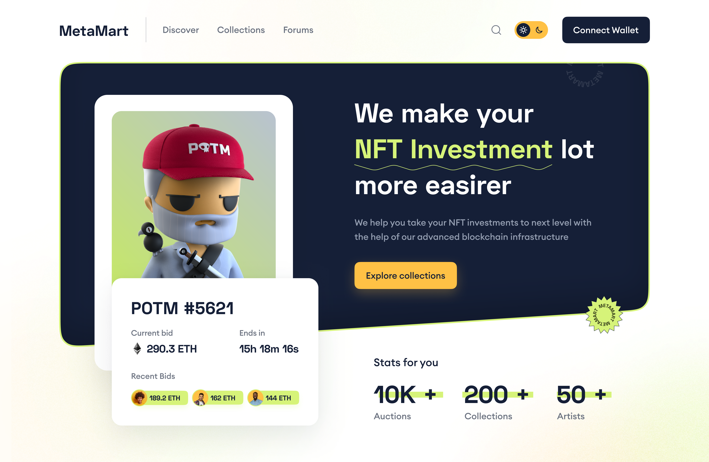

# Meta Mart


## Install all dependencies and run

```bash
npm install
```

Run the server:

```bash
npm run start
# or
yarn start
```

Open [http://localhost:3000](http://localhost:3000) with your browser to see the result.

## More
- To preview, click
[live preview](https://meta-mart-octopse.vercel.app/)
- A design from [figma.com](https://www.figma.com/file/QEnT0JENnriM1z6gzz0Mn6/MetaMart?node-id=120%3A6)

